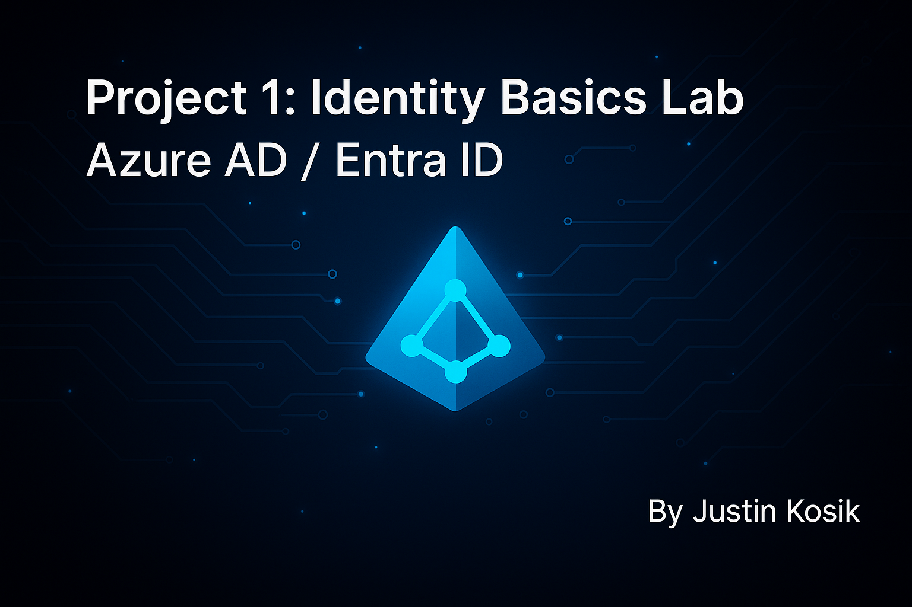
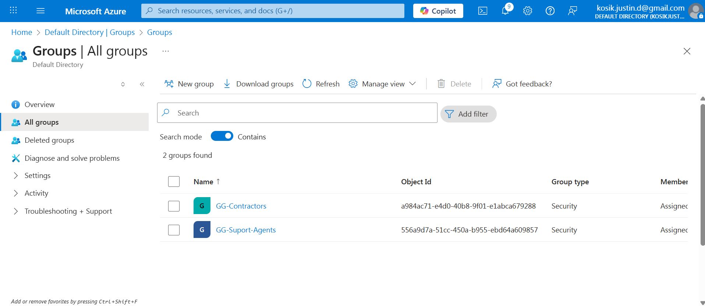

<p align="center">
  
</p>

<h1 align="center">🔐 Project 1 — Microsoft Entra ID Identity Basics Lab</h1>
<h3 align="center">Identity Structure ▸ Role-Based Access ▸ Zero Trust Foundations</h3>

---

## 📌 Overview

This project builds a strong IAM foundation inside Microsoft Entra ID (Azure AD) by:

✔ Structuring identities into **security-scoped groups**  
✔ Assigning **role-based permissions using PIM-ready least privilege**  
✔ Separating **employees, support staff, and external contractors**  
✔ Creating a **real-world baseline** that future IAM controls depend on

This is **Project 1** of a 4-project enterprise IAM series.

---

## 📚 Table of Contents

- [Objectives](#-objectives)
- [Identity Architecture](#-identity-architecture)
- [Users](#-users)
- [Groups](#-groups)
- [Role Assignments](#-role-assignments)
- [Security Rationale](#-security-rationale)
- [What I Learned](#-what-i-learned)
- [Next Project → MFA Enforcement](#-next-project)
- [Repo Structure](#-repo-structure)

---

## 🎯 Objectives

| Goal | Outcome |
|------|---------|
| Build IAM baseline | Users + Groups + Role assignments |
| Enforce least privilege | No standing global admin |
| Prepare for Zero Trust | Segmentation & RBAC separation |
| Enable audit visibility | Screenshots + documentation |

---

## 🏗 Identity Architecture

```text
├── Employees
│ ├── IT Support
│ └── Standard Users
└── Contractors
```


➡ Contractors **must NEVER** inherit employee entitlements  
➡ All privileged access is **assigned via group**, not directly

---

## 👤 Users
<details open>
<summary><strong>👤 Users List</strong></summary>

| User | Type | Role |
|------|------|------|
| Sierra Nova | Employee | IT Support |
| Nathan Dash | Employee | Standard |
| Eddie Spark | Contractor | Vendor |

**Screenshot:**  


</details>

---

## 👥 Groups
<details>
<summary><strong>👥 Groups</strong></summary>

**Baseline Groups**

| Group | Purpose |
|-------|---------|
| GG-AllUsers | All internal employees |
| GG-IT-Support | Privileged helpers |
| GG-Contractors | Segmented external users |

**Screenshots:**  
  
  


</details>

---

## 🛡 Role Assignments
<details>
<summary><strong>🛡 Role Delegation</strong></summary>

| Role | Assigned To | Reason |
|------|-------------|--------|
| Helpdesk Admin | GG-IT-Support | Reset passwords only |
| Password Admin | Nathan Dash | Non-admin user with scoped rights |

**Screenshots:**  
  


</details>

---

## 🧠 Security Rationale

✔ **No standing Global Admin** — reduces breach blast radius  
✔ **Privileged groups only** — enables PIM activation later  
✔ **Contractor isolation** — required for SOC2, ISO27001, & PCI  
✔ **Least privilege documented** — auditors require justification

---

## 🧠 What I Learned

🔹 How enterprise identity structure affects Zero Trust  
🔹 Why permissions must live in **groups, not users**  
🔹 How to document IAM decisions for auditors & hiring managers  
🔹 Why contractors require **separate identity boundaries**  

---

## ▶️ Next Project

🔗 **Click here to continue the IAM lab series →**
https://github.com/CoachKosik/azure-ad-mfa-enforcement


---

## 📂 Repo Structure

```text
Azure-AD-Entra-ID-Identity-Basics-Lab/
│ README.md
└── screenshots/
├─ identity_basics_banner.png
├─ users-list.png
├─ groups-list.png
├─ support-agents-members.png
├─ contractors-members.png
├─ mav-user-admin.png
├─ nate-password-admin.png
```

---

⭐ **If this project was useful, consider starring the repo!**  
🧑‍💻 Follow the full IAM series at: https://github.com/CoachKosik
