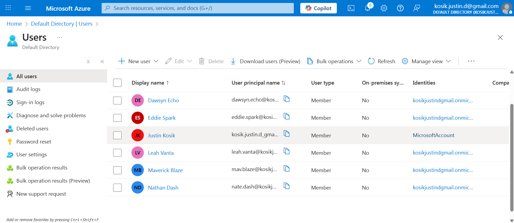
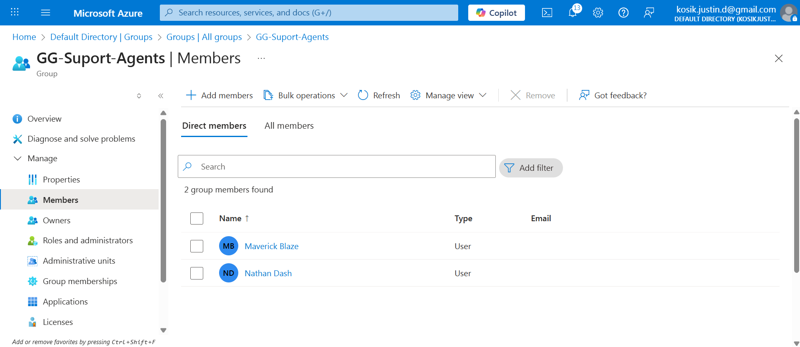
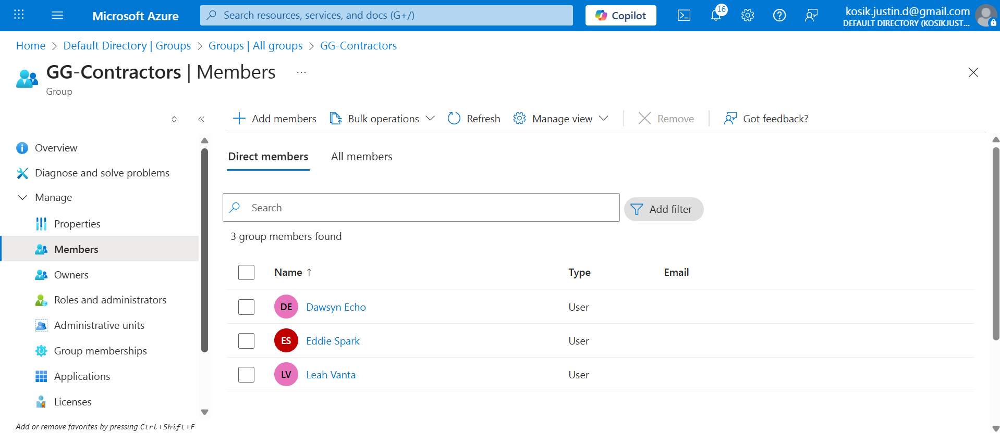
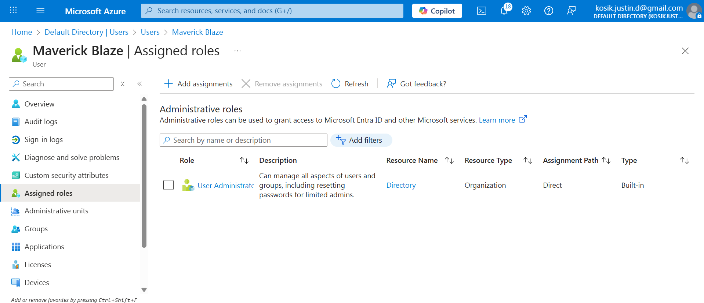
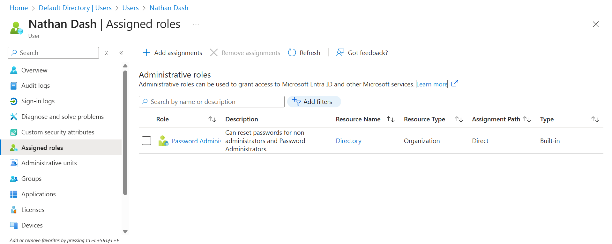

# Azure AD / Entra ID — Identity Basics Lab

**Objective:** Demonstrate identity creation, grouping, and role-based access control (RBAC) within Microsoft Entra ID (Azure AD). This lab establishes core IAM fundamentals used in enterprise identity management and access governance.

## Tenant
- Tenant: `[yourtenant.onmicrosoft.com]`
- Admin role used: **Global Administrator**

## Tasks Completed
1. Created five users:
   - Maverick Blaze  
   - Nathan Dash  
   - Leah Vanta  
   - Dawsyn Echo  
   - Eddie Spark  
2. Created two security groups:
   - `GG-Support-Agents`  
   - `GG-Contractors`  
3. Added members to each group based on access needs.
4. Assigned roles:
   - Maverick → **User Administrator**
   - Nathan → **Password Administrator**
   - Contractors → **No roles** (least privilege)
5. Documented least-privilege decisions.

## RBAC & Least Privilege Table

| User      | Group               | Role                   | Reason (Least Privilege) |
|-----------|----------------------|-------------------------|---------------------------|
| Maverick  | GG-Support-Agents    | User Administrator      | Needs to manage identities |
| Nathan    | GG-Support-Agents    | Password Administrator  | Only handles password resets |
| Leah      | GG-Contractors       | None                    | Contractor, minimal access |
| Dawsyn    | GG-Contractors       | None                    | Contractor, minimal access |
| Eddie     | GG-Contractors       | None                    | Contractor, minimal access |

## 🔐 Access Governance & Security Rationale

### ✅ Why RBAC Matters
Role-Based Access Control (RBAC) ensures users get only the permissions needed to perform their job functions. Assigning scoped directory roles (instead of broad admin rights) reduces the risk of accidental changes, privilege misuse, and security incidents. RBAC also makes access predictable, auditable, and scalable across the organization.

### ✅ Why User Administrator & Password Administrator Should Be Separate
Separating these duties enforces **segregation of responsibilities**:
- **User Administrator**: create/manage users and groups.
- **Password Administrator**: reset passwords without changing identities or roles.
This limits the blast radius of any single account compromise and prevents concentration of sensitive powers.

### ✅ Why Contractors Should Not Have Admin Roles
Contractors generally require temporary, narrowly scoped access and may operate outside core security controls. Granting admin roles increases risk of:
- Excessive permissions and data exposure
- Insider threats or credential leakage
- Lingering access after contract end
Keeping contractors non-privileged enforces **least privilege** and reduces potential impact.

### ✅ Principle of Least Privilege
Provide the **minimum** access required—nothing more. Least privilege:
- Shrinks the attack surface
- Limits damage if credentials are compromised
- Improves auditability and compliance
- Aligns access with defined job duties
All group memberships and role assignments in this lab were chosen to reflect least-privilege identity management.

## Screenshots

### Users

### Groups

### Group Memberships

### Role Assignments

## What I Learned
- How to create and manage identities in Microsoft Entra ID  
- How to create and manage security groups  
- The relationship between identities, groups, and directory roles  
- How RBAC enforces least privilege and reduces security risk  
- Why separating identity admins and password admins limits blast radius  

## Next Steps
- Implement MFA requirements and test sign-in scenarios (Project 2)  
- Build Joiner–Mover–Leaver lifecycle (Project 3)  
- Configure Conditional Access (future project)  
